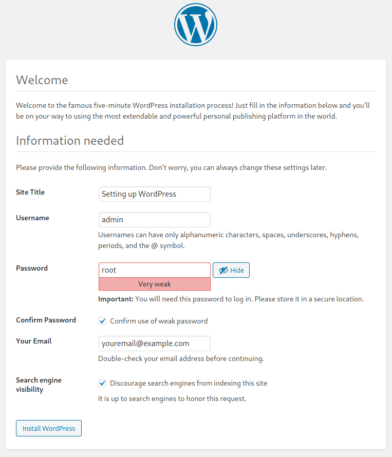

# Setting up WordPress on Linux

This guide shows you how to install and setup WordPress on any *Ubuntu*-derivative (you’ll be redirected to the appropriate guide) and *Arch*-derivatives.

Run the installation script. If everything is successful, the following page should open in your default browser:


Click on the `Let's go!` button. Use the following connection details:

- **Database name:** `wordpress`
- **Username:** `admin`
- **Password:** `password`
- **Database Host:** `localhost`
- **Table Prefix:** `wp_` 


Click on `Submit`. If everything is OK, you should see this page:


Click on `Run the installation`. All of the following details are up to you to pick. 



Click on `Installat WordPress`, and you’ll be ready to go!

## Customizing the script

If you wish to use a different database name, username and password, you can change the `mysql` queries accordingly:

```bash
sudo mysql -e "CREATE USER 'your-username'@'localhost' IDENTIFIED BY 'your-password';"
sudo mysql -e "GRANT ALL PRIVILEGES ON mydb.* TO 'your-username'@'localhost';"
sudo mysql -e "FLUSH PRIVILEGES;"
sudo mysql -e "CREATE DATABASE your-database-name;"
sudo mysql -e "GRANT ALL PRIVILEGES ON your-database-name.* TO 'your-username'@'localhost' IDENTIFIED BY 'your-password';"
sudo mysql -e "FLUSH PRIVILEGES;"
```

## Reference

This guide is based on [ArchWiki WordPress](https://wiki.archlinux.org/index.php/Wordpress) and automates the process described there.

